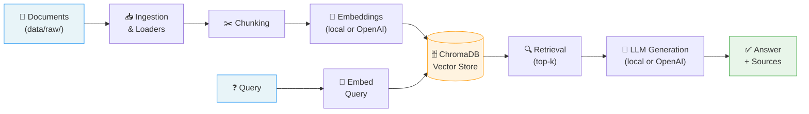
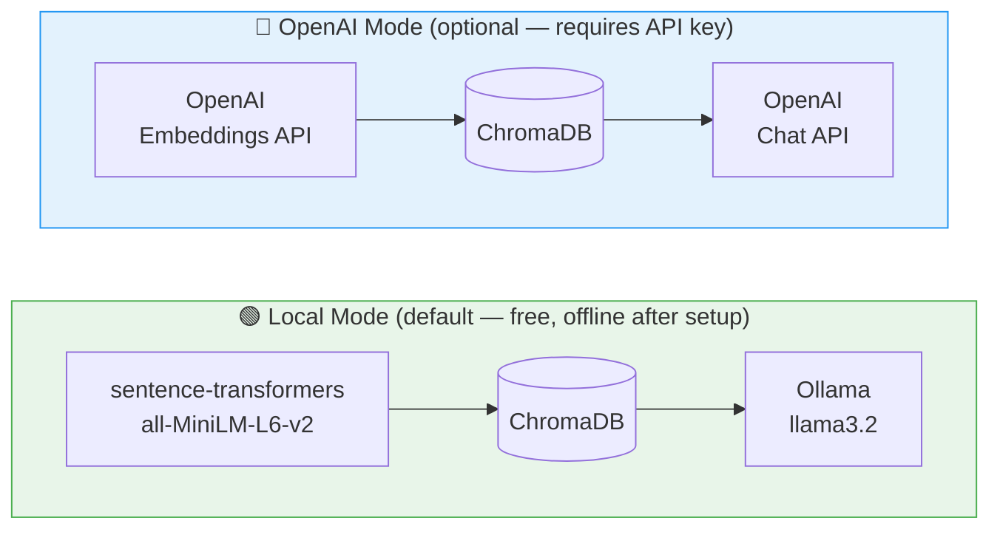

# RAG Pipeline


A complete Retrieval-Augmented Generation pipeline in Python. Ingests documents, chunks them, embeds them, stores in ChromaDB, and generates grounded answers with source citations.

**Runs fully free by default** — local embeddings via [sentence-transformers](https://www.sbert.net/) and a local LLM via [Ollama](https://ollama.com). No API keys, no cloud costs. OpenAI is available as an optional alternative if you prefer.

---

### How It Works



### Supported Modes



> You can also mix modes — e.g. local embeddings (free) with OpenAI generation, or vice-versa.

---

## 🚀 Quick Start

### 1. One-time setup

```bash
brew install ollama          # or download from https://ollama.com
ollama pull llama3.2         # ~2 GB download, one-time
python3 -m venv venv
source venv/bin/activate
pip install -r requirements.txt
```

### 2. Index your documents

Place `.txt`, `.md`, or `.pdf` files in `data/raw/`, then:

```bash
./rag index
```

### 3. Ask a question

```bash
./rag query "What is retrieval-augmented generation?"
```

> **What is `./rag`?** It's a small bash wrapper that checks if Ollama is running (starts it if not) and runs `main.py` through the project's virtual environment. No manual `source venv/bin/activate` or `ollama serve` needed.

> **Want more detail?** See the full [Step-by-Step Walkthrough](WALKTHROUGH.md) — covers prerequisites, first-time setup, example output, OpenAI mode, and troubleshooting.

<details>
<summary><strong>Manual alternative (Windows / Linux / no wrapper)</strong></summary>

If `./rag` doesn't work on your system (it's a bash script, macOS/Linux only), run the commands directly:

```bash
ollama serve                 # leave running in a separate terminal
source venv/bin/activate     # activate the virtual environment
python main.py index
python main.py query "What is retrieval-augmented generation?"
```

</details>

---

## ⚙️ Configuration

All tunable parameters live in [`config.yaml`](config.yaml):

| Parameter | Default | Description |
|---|---|---|
| `embeddings.provider` | `"local"` | `"local"` — sentence-transformers, free, no API key · `"openai"` — requires `OPENAI_API_KEY` |
| `embeddings.model` | `"all-MiniLM-L6-v2"` | Model name. Local: any sentence-transformers model · OpenAI: e.g. `"text-embedding-3-small"` |
| `embeddings.dimension` | `384` | Must match the model (384 for all-MiniLM-L6-v2, 1536 for text-embedding-3-small) |
| `generation.provider` | `"local"` | `"local"` — Ollama, free, no API key · `"openai"` — requires `OPENAI_API_KEY` |
| `generation.model` | `"llama3.2"` | Model name. Local: any Ollama model · OpenAI: e.g. `"gpt-4o-mini"` |
| `generation.temperature` | `0.2` | LLM temperature |
| `generation.max_tokens` | `1024` | Max output tokens |
| `chunking.chunk_size` | `512` | Max tokens per chunk |
| `chunking.overlap` | `50` | Overlapping tokens between consecutive chunks |
| `retrieval.top_k` | `5` | Number of chunks retrieved per query |
| `retrieval.score_threshold` | `0.5` | Minimum cosine-similarity score; lower-scoring chunks are dropped |

<details>
<summary><strong>🔵 Switching to OpenAI mode</strong></summary>

If you'd rather use OpenAI models:

1. Copy `.env.example` → `.env` and set your `OPENAI_API_KEY`.
2. Update `config.yaml`:

```yaml
embeddings:
  provider: "openai"
  model: "text-embedding-3-small"
  dimension: 1536

generation:
  provider: "openai"
  model: "gpt-4o-mini"
```

You can also mix providers (e.g. local embeddings + OpenAI generation).

</details>

---

## 📄 Adding Documents

Drop `.txt`, `.md`, or `.pdf` files into `data/raw/`, then re-index:

```bash
./rag index
```

Re-indexing is safe — duplicate chunks are upserted, not duplicated.

---

## 📁 Project Structure

```
src/
├── config.py                  # Central config loader (config.yaml + .env)
├── pipeline.py                # End-to-end pipeline orchestrator
├── ingestion/
│   ├── loaders.py             # File loaders (txt, md, pdf)
│   └── chunker.py             # Token-aware chunking with overlap
├── embeddings/
│   ├── base.py                # Abstract EmbeddingProvider interface
│   ├── openai_embeddings.py   # OpenAI implementation
│   ├── local_embeddings.py    # Local implementation (sentence-transformers)
│   └── factory.py             # Provider factory
├── retrieval/
│   ├── vector_store.py        # Abstract VectorStore + SearchResult
│   ├── chroma_store.py        # ChromaDB implementation
│   └── retriever.py           # Query embedding + search
├── generation/
│   ├── prompts.py             # Prompt templates (named constants)
│   ├── llm.py                 # OpenAI LLM client
│   ├── local_llm.py           # Local LLM client (Ollama)
│   └── factory.py             # LLM client factory
└── eval/                      # Evaluation scripts (future)

data/
├── raw/                       # Source documents (add yours here)
└── processed/                 # Chunked data & ChromaDB storage (gitignored)

tests/                         # Mirrors src/ structure
config.yaml                    # All tunable parameters
main.py                        # CLI entry point
rag                            # Convenience wrapper script (bash)
```

---

## 🧪 Running Tests

```bash
pytest tests/ -v
```

All tests use mocks — no API key, Ollama server, or model download required.

---

## 🐛 Debug Mode

```bash
./rag --debug query "Your question"
```

Logs the full assembled prompt sent to the LLM.
